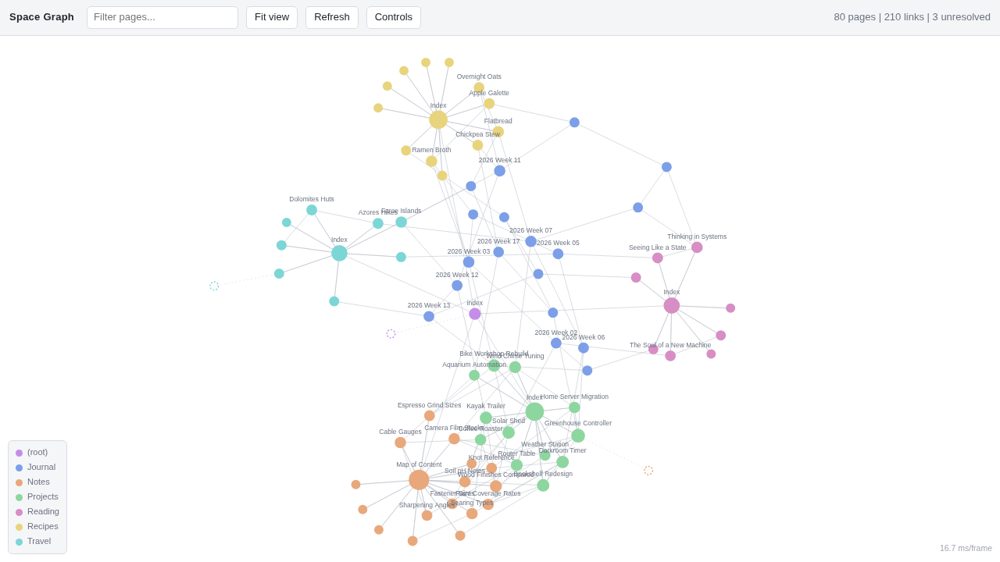

# silverbullet-graph

An Obsidian-style interactive link graph for a [SilverBullet](https://silverbullet.md)
space, as a small companion container.

SilverBullet v2 has no built-in graph view. This adds one: every page is a node,
every `[[wikilink]]` or internal Markdown link an edge, coloured by top-level
folder and sized by how many links it has. It runs alongside SilverBullet,
reads the space through SilverBullet's own HTTP API, and updates incrementally
as you write.



*Rendered from the bundled demo space. Every page name in that screenshot is
invented; see [Try it without SilverBullet](#try-it-without-silverbullet).*

Tested against SilverBullet **2.9.0**.

## What you get

- **Full view** with search, layout controls and a folder legend.
- **Embeddable preview** you can drop into your index page with a Space Lua widget.
- **Live updates.** A page save pushes a webhook and only that page is reparsed.
- **Broken-link detection.** Wikilinks pointing at pages that do not exist are
  drawn as hollow, dashed nodes.
- **Canvas renderer**, so a few thousand edges stay at 60fps and the page does
  no work at all once the layout settles.
- Works with mouse and touch: drag nodes, pinch, pan.

## How it stays current without rescanning everything

Two paths, and the second is the one that matters.

**Fast path.** A `space-lua` hook on `editor:pageSaved` POSTs the page name to
`/api/notify`. The server refetches exactly that page.

**Correctness backstop.** `editor:pageSaved` is a *client-side* event: it only
fires inside an open browser tab. Anything writing through the HTTP API
directly — a CLI, a script, another agent — produces no event at all. So every
`RECONCILE_INTERVAL` seconds the server issues **one** request, `GET /.fs/`,
which returns every file with its `lastModified` and `size`, diffs it against
what it holds, and refetches **only** the entries that moved. Deletions are
handled the same way.

A full reparse happens on a cold cache or on an explicit `POST /api/rebuild`,
and nowhere else.

## Try it without SilverBullet

There is a self-contained demo that serves the UI against a synthetic space, so
you can see the thing working, or hack on the front-end, with nothing else
running:

```sh
python3 demo/demo_server.py        # then open http://localhost:8899/
```

It builds 80 invented pages across six folders, with hub pages, a journal that
threads through everything, and three deliberately dangling links so the hollow
"unresolved" style is visible. The generator is seeded, so the graph is
identical on every run. Standard library only, no dependencies.

## Quick start

Requires an existing SilverBullet container and a docker network you can join.

```sh
git clone https://github.com/fperdigon/silverbullet-graph.git
cd silverbullet-graph
cp .env.example .env      # then put your SilverBullet token in it
$EDITOR .env               # set SILVERBULLET_PUBLIC_URL and the token
docker compose up -d --build
```

Everything is configured through `.env`; the compose file itself needs no edits.
`SB_AUTH_TOKEN` must match the token SilverBullet itself was started with, and
`SILVERBULLET_PUBLIC_URL` must be your real SilverBullet URL or node clicks go
nowhere useful.

Then point a reverse proxy at the container on port 8000. If you use Caddy:

```caddy
graph.example.com {
    reverse_proxy sb-graph:8000 {
        # /api/events is Server-Sent Events: never buffer it.
        flush_interval -1
    }
}
```

That `flush_interval -1` is not optional. Without it the proxy buffers the
event stream and live updates arrive in batches or not at all.

## Wiring it into SilverBullet

**Save hook** — add to your `CONFIG` page:

```lua
event.listen {
  name = "editor:pageSaved",
  run = function(e)
    local page = e.data and e.data.name
    if not page then return end
    pcall(function()
      net.proxyFetch("https://graph.example.com/api/notify", {
        method = "POST",
        headers = { ["Content-Type"] = "application/json" },
        body = { page = page },
      })
    end)
  end
}
```

`net.proxyFetch` routes through the SilverBullet server, so this works without
CORS. The `pcall` matters: without it, a stopped graph container would make
saving a page throw.

**Embed on your index page:**

```markdown
${widget.html(dom.iframe {
  src = "https://graph.example.com/embed",
  loading = "lazy",
  style = "width:100%;height:400px;border:1px solid #3a3f47;border-radius:8px;"
})}
```

## Configuration

| Variable | Default | Notes |
|---|---|---|
| `SILVERBULLET_URL` | `http://silverbullet:3000` | internal address, over the docker network |
| `SILVERBULLET_PUBLIC_URL` | same as above | used only to build clickable links |
| `SILVERBULLET_TOKEN` | from `.env` | SilverBullet's `SB_AUTH_TOKEN` |
| `RECONCILE_INTERVAL` | `300` | seconds between reconciles |
| `EXCLUDE_PREFIXES` | `Library/` | comma-separated folders to keep out |
| `FETCH_CONCURRENCY` | `8` | parallel page fetches |
| `LOG_LEVEL` | `INFO` | |

`Library/` is excluded by default because it holds SilverBullet's own std
library, which is machinery rather than content.

## Endpoints

| Path | Purpose |
|---|---|
| `/` | full graph |
| `/embed` | compact preview for an iframe |
| `/api/graph` | nodes, links and stats as JSON |
| `/api/notify` | `POST {"page": "..."}` — refetch one page |
| `/api/rebuild` | `POST` — force a full reparse |
| `/api/events` | SSE; open views redraw on change |
| `/healthz` | page count, version, asset hash |

## Layout controls

Behind the **Controls** button. All saved to `localStorage`, so they are
per-browser.

Repulsion, link distance, link rigidity, node spacing, gravity, node size,
label cutoff, show labels, show unresolved, pin nodes on drop, freeze layout.

Drag a node to move it. By default it rejoins the layout on release; turn on
**Pin nodes where I drop them** and it stays put, marked with a ring.
Double-click a node to unpin it, or empty space to unpin everything.

## Notes for anyone hacking on it

A few things here are not obvious and were expensive to find:

- **After changing the parser, call `/api/rebuild`.** A normal reconcile only
  refetches files whose mtime moved, and parser changes do not touch mtimes, so
  cached pages keep their old link lists.
- **d3-zoom writes `touch-action: none` as an inline style.** No stylesheet rule
  can override it. The embedded preview undoes it in JS so it does not swallow
  page scroll on a phone.
- **d3 gates its touch listeners behind `navigator.maxTouchPoints`,** which
  reports 0 under device emulation and is unreliable in some in-app browsers.
  Both drag and zoom force `.touchable(() => true)`.
- **`d3-drag` computes deltas in whatever space the subject reports.** The
  subject here returns screen coordinates and the handler inverts through the
  zoom transform; returning simulation coordinates drifts as soon as you zoom.
- **Static assets are content-hashed** into a `?v=` query string, because
  `StaticFiles` sets only `ETag`/`Last-Modified` and browsers reuse those
  without revalidating. `/healthz` reports the current hash.

## Licence

MIT, see [LICENSE](LICENSE).

Bundles [D3](https://d3js.org) v7 (ISC, Mike Bostock) at
`static/vendor/d3.min.js`; its copyright header is preserved in the file.
